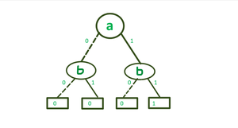
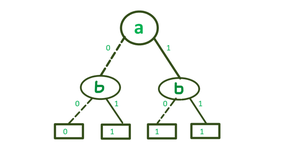
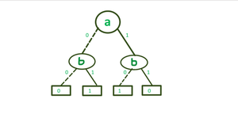

# BINARY DECISION DIAGRAMS (BDD)

## What's a BDD?
A BDD is a set of an <b>acyclic, rooted graph </b>with directed edges.
Non-terminal nodes are called <b>decision nodes</b>, labelled with a boolean variable. Each decision node has two child nodes:
1) <b>Low Child</b>: the left one
2) <b>High Child</b>: the right one

Therefore, each decision node has 2 edges. The left edge (linked to its low-child) assigns
<b> False </b> to the node, the right one (linked to high-child) assigns <b> True</b>.

A BDD is ordered (<b>OBDD</b>) if different variables appears in the same order in every path in the BDD.

## BDDs for main formulas
As you will see, it is possible to obtain the value of the formula just following a path in the
BDD. Once the left (right) child is chosen, then the node is assigned to FALSE (TRUE).

### BDD for A AND B
\
*BDD for the formula A AND B*

### BDD for A OR B
\
*BDD for the formula A OR B*

### BDD for A XOR B
\
*BDD for the formula A XOR B*

## Variable Ordering in BDD
The size of BDD is determined both by the function being represented and the chosen ordering of
the variables. For some functions, the size of a BDD may vary between a linear to an exponential
range depending upon the ordering of the variables.

| | |
|---|---|
|  |  |
| *BDD with bad order* | *BDD with good order* |

As we can see from the images, the size of the BDD with a bad variable order
explodes, while the second one, although representing the same logical formula, uses a good order and remains reasonably small.

## Why BDDs?
BDDs, more precisely OBDDs, are helpful in functional equivalence checking and other operations like
functional technology mapping.
A path from root to 1-terminal (0-terminal) leaf, represents a (possibly partial) variable assignment for which the 
represented formula is TRUE (FALSE).

## How to reduce a BDD
The steps to *reduce* a BDD are:
- if BDD has more than two distinct leaves (one labeled *T* and one labeled *F*), remove duplicate leaves. Direct all edges that pointed to leaves to the remaining two leaves;
- if there is a node p_i linked both right and left to the same node p_j, then delete p_i and let the previous node aim directly to p_j;
- if p_i and p_j are roots od the same sub-BDDs, delete one sub-BDD and direct its incoming edges to the other node.

## How to *apply* boolean operations to BDDs

## How to build a BDD
The idea is to start from a logical formula such as <code>(p and q) or ~r</code> and recursively build a BDD.
- build the *AST* from the formula;
- transform each node of the *AST* to BDD;
- combine recursively the BDDs (with bool operations) to create the formula final BDD.

The *build* procedure creates an ordered-reduced BDD.
