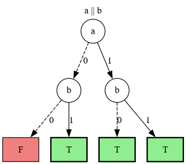
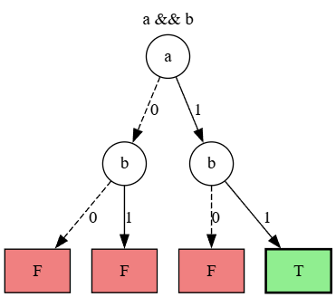
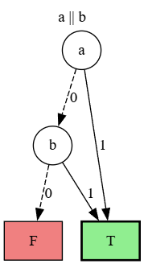
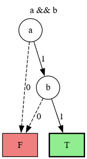
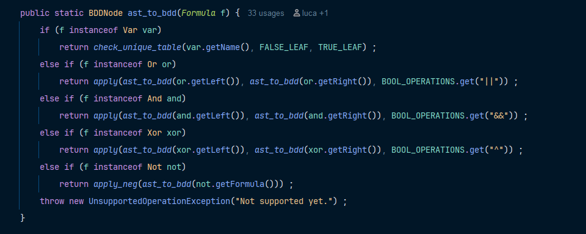
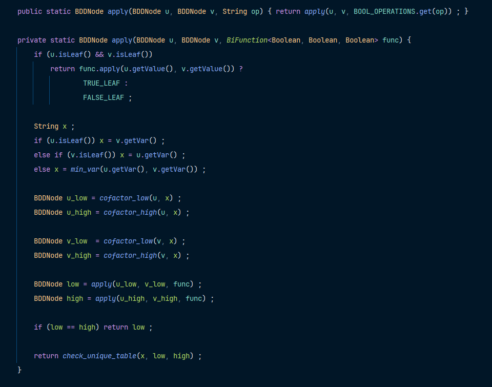
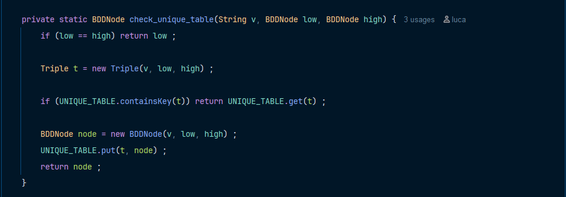
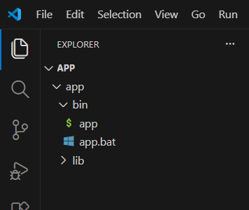
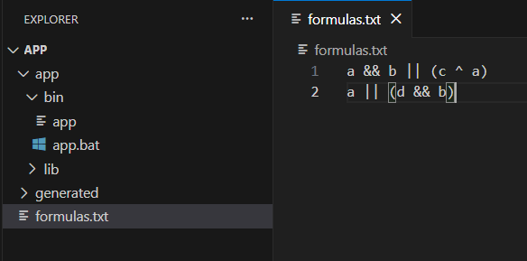
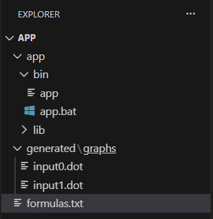

# BINARY DECISION DIAGRAMS (BDD)

## Table of Contents
- [What is a BDD?](#what-is-a-bdd)
- [How to run the app](#how-to-run-the-app)
- [Requirements](#requirements)

## What is a BDD?
A BDD is a data structure used to represent a Boolean function as a *rooted, directed acyclic* graph.
Non-terminal nodes are called **decision nodes**, labelled with a Boolean variable. Each decision node has two outgoing edges 
corresponding to the possible assignments of the variable:
1) **Low Child (0-edge)**: represents the assignment *False*
2) **High Child (1-edge)**: represents the assignment *True*

The diagram also contains **terminal nodes** labelled *True* and *False*, which represent the final value of the Boolean function.
Evaluating a path in the diagram corresponds to assigning values to the variables (decision nodes) along the same path until a terminal
node is reached. The label of a terminal node represents the resulting value of the Boolean function under those assignments.

### Some examples
#### A OR B
<a id="a-or-b"></a>
\
This is the BDD for the Boolean function <code>a || b</code>. The diagram can be interpreted as follows:
- Assigning 1 to <code>a</code> results in the function evaluating to *True*, regardless of the value assigned to <code>b</code>.
- Assigning 0 to <code>a</code>, the function evaluates to *True* if <code>b</code> is *True*, and to *False* if <code>b</code> is *False*.

#### A AND B
<a id="a-and-b"></a>
\
This is the BDD for the Boolean function <code>a && b</code>. As in the previous example, we can evaluate the function by following the paths in the diagram:
- Assigning 1 to <code>a</code> the function will be evaluated *True* only if we follow the 1-edge for <code>b</code>.
- On the other hand, if we assign 0 to <code>a</code> the function always evaluates to *False*, regardless of the value of <code>b</code>.

## Why BDDs?
Boolean functions can be represented in many ways such as truth tables, but each has its limitations.

A truth table is the most popular representation: it explicity lists the output for every possible combination of inputs.
However, for a function with n variables, the truth table has 2<sup>n</sup> rows. Verifying whether two functions are equivalent,
for instance, would require comparing all 2<sup>n</sup> rows.

BDDs overcome this problem: two logically equivalent formulas will always produce the same reduced BDD (given the same variable ordering).

On the other hand, as we will discuss soon, choosing a good variable ordering is not that easy: in the worst case, a poor ordering can cause the BDD to grow exponentially in size, making it impractical.

## Reduced Binary Decision Diagrams
In the BDD representing the Boolean function [A or B](#a-or-b), we can observe that the diagram can be reduced. As discussed earlier, regardless of the value of <code>b</code>,
if we assign 1 to <code>a</code> the function evaluates to *True* due to the OR property.
Therefore, the BDD can be reduced by removing the decision node <code>b</code> from the branch where <code>a = 1</code>.
The resulting *Reduced Binary Decision Diagram* for <code>a || b</code> is shown in the figure below.

<a id="a-and-b-reduced"></a>
\

The same reduction principle can be applied to the BDD representing [A and B](#a-and-b). Since the AND function evaluates to *True* only
when both variables are assigned *True*, the resulting **reduced** BDD is shown below.



## How to reduce a BDD
**Input**: A *bdd*.\
**Output**: A reduced binary decision diagram *bdd'*\
**Steps of the algorithm**:
1. If *bdd* has more than two distinct leaves (one labeled T and one labeled F), remove duplicate leaves. Direct all edges that pointed to leaves
to the remaining two leaves </li>
2. Perform the following steps as long as possible: </li>
   1. If both outgoing edges of a node labeled p<sub>i</sub> point to the same node labeled p<sub>j</sub>, delete this node for p<sub>i</sub> and direct p<sub>i</sub>'s incoming edges to p<sub>j</sub>.
   2. If two nodes labeled p<sub>i</sub> are the roots of identical sub-BDDs, delete one sub-BDD and direct its incoming edges to the other node.

## Ordered Binary Decision Diagram (OBDD)
An **OBDD** is a BDD such that the set of orderings of atoms defined by the branches is compatible.
The size of the diagram vary based on both the function being represented and by the chosen ordering of the variables.
Different variable orderings may lead to dramatically different BDD sizes. In some cases, a function that has a linear-size
BDD under one ordering may require an exponential-size BDD under another ordering.
Find the best variable ordering is quite difficult (*NP-hard*), usually heuristic algorithms are used.

## How to apply operators to BDDs
The power of BDDs is the ability to perform operations directly on two reduced BDDs.

Given two **reduced** BDDs bdd<sub>1</sub>, bdd<sub>2</sub> and an operator *op*,
the algorithm named `Apply` recursively constructs the BDD for <code>bdd<sub>1</sub> *op* bdd<sub>2</sub></code>.
The algorithm is described as follows:

**Input**: OBDDs bdd<sub>1</sub> for formula A<sub>1</sub> and bdd<sub>2</sub> for formula A<sub>2</sub> and an operator *op*.\
**Output**: An OBDD for the formula <code>A<sub>1</sub> *op* A<sub>2</sub></code>.\
**Steps of the algorithm**:
1) If bdd<sub>1</sub> and bdd<sub>2</sub> are both leaves labeled w<sub>1</sub> and w<sub>2</sub>, respectively, return the leaf
labeled by w<sub>1</sub> *op* w<sub>2</sub>.
2) If the roots of bdd<sub>1</sub> and bdd<sub>2</sub> are labeled by the same atom *p*, return the following
   BDD:(a) the root is labeled by p; (b) the left sub-BDD is obtained by recursively
   performing this algorithm on the left sub-BDDs of bdd<sub>1</sub> and bdd<sub>2</sub>; (c) the right
   sub-BDD is obtained by recursively performing this algorithm on the right sub
   BDDs of bdd<sub>1</sub> and bdd<sub>2</sub>.
3) If the root of bdd<sub>1</sub> is labeled *p<sub>1</sub>* and the root of bdd<sub>2</sub> is labeled *p<sub>2</sub>* such that
   <code>p1 < p2</code> in the ordering, return the following BDD: (a) the root is labeled by p<sub>1</sub>;
   (b) the left sub-BDD is obtained by recursively performing this algorithm on the
   left sub-BDD of bdd<sub>1</sub> and on (the entire BDD) bdd<sub>2</sub>; (c) the right sub-BDD is
   obtained by recursively performing this algorithm on the right sub-BDD of bdd<sub>1</sub>
   and on (the entire BDD) bdd<sub>2</sub>.
4) Otherwise, we have a symmetrical case to the previous one. The BDD returned
   has its root labeled by *p<sub>2</sub>* and its left (respectively, right) sub-BDD obtained by
   recursively performing this algorithm on bdd<sub>1</sub> and on the left (respectively, right)
   sub-BDD of bdd<sub>2</sub>.

## Implementation
### From AST to BDD: `ast_to_bdd`
This method takes a `Formula` and recursively builds the corresponding `BDDNode` (representing a BDD instance). 
The base case is a `Var` node (a single Boolean variable), in which a BDD node is created with `FALSE_LEAF` as the low child
and `TRUE_LEAF` as the high child.

On the other hand, for composite formulas (`Or`, `And`, `Xor`) the method calls itself on both sub-formulas and then calls `apply` with the
right operator obtained from `BOOL_OPERATION`. The negation of a formula (`Not`) is treated with a dedicated method, `apply_neg`, which simply
swaps the terminal nodes recursively.



`BOOL_OPERATIONS` is a static field initialized as follows:
```java
    static {
            BOOL_OPERATIONS.put("&&", (a,b) -> a && b) ;
            BOOL_OPERATIONS.put("||", (a,b) -> a || b) ;
            BOOL_OPERATIONS.put("^",  (a,b) -> a ^ b)  ;
       }
```

### Apply and Reduce: `apply`
The `apply` method implements both *Apply* and *Reduce* procedures at once. Given two nodes `u` and `v` and a Boolean operator, it
constructs the reduced BDD for `u op v`.

\
The algorithms proceeds as follows:
1) If both `u` and `v` are leaves, the result is the terminal (`TRUE_LEAF` or `FALSE_LEAF`) node corresponding to `u.value op v.value`
2) The variable `x` is selected applying variable ordering (lexicographical order in this case) to `u` and `v`. If one of the two nodes is a leaf, the variable of the other is used
3) For each of `u` and `v`, the low and the high cofactors (respecting `x`) are computed with `cofactor_low` and `cofactor_high`.
    The cofactor of a node `n` respecting `x` returns `n.low` (or `n.high`) if `n.var == x`, or `n` itself otherwise. This is the *Shannon expansion*
4) `apply` is called recursively on the low cofactors and then on the high cofactors
5) Before creating a new node, two reduction rules are applied:
   - if `low == high` (by reference), the node is the same and `low` is returned
   - otherwise, the method `check_unique_table` is called. If a node with same `<var, low, high>` (has a `Triple`) already exists in the `UNIQUE_TABLE`, the cached node is returned
   instead of creating a new one

### The Unique Table
`UNIQUE_TABLE` is a cache table that maps each `<var, low, high>` triple to its unique BDD instance, in order to find quickly isomorphic subgraphs.
It also avoids creating duplicate nodes and it speeds up computation. 



Because the unique table stores BDD nodes across calls, `clear_cache()` should be called between indipendent BDD constructions.

```java
    private static final HashMap<Triple, BDDNode> UNIQUE_TABLE = new HashMap<>() ;
    public static void clear_cache() { UNIQUE_TABLE.clear() ; }
```

## How to run the app
There are two ways to run the app: running the [deployment version](#deploy) or the [source code](#source-code).
For a quick test of the application, the deployment version is recommended.

<a id="deploy"></a>
### Deploy version
First, unzip the file <code>app.zip</code> in any location of your computer. After this, you can open the *app* directory
with any editor (i.e. Visual Studio Code) as shown below.



The app can be launched with the <code>app.bat</code> (on Windows) file: type in the command line <code>app/bin/app.bat</code>.
In case you run on Linux, you must run the `app.sh` file located in the same directory as the `app.bat` file. Then just run `app/bin/app`.
This commands will launch the <code>Main</code> of the application with the default input file.

It is also possible to add command line arguments before launching the program, the arguments accepted are:
- ``--no-benchmark`` which ignores the standard benchmarks included in the project.
- ``--no-scalability`` which ignores the scalability tests.

### Input
If you want to test your own formulas, you should create a file named <code>formulas.txt</code> (the name **must** be the same),
write all the Boolean function you want and then just run <code>app.bat</code> (or `app`) again.



Input formulas are not checked, so here are some guidelines you should know before writing your own input:
- Operators accepted: <code>||, &&, !, ^, =></code> (OR, AND, NOT, XOR, IMPLIES)
- Precedence can be controlled using parenthesis <code>()</code>
- Spaces between formulas and operators are accepted but not necessary
- The application is <code>case-sensitive</code> therefore <code>a</code> and <code>A</code> are treated as different variables
- Do not leave empty lines between formulas

For example, if you **do not** create your own <code>formulas.txt</code> the program will run with this standard file as input:
```text
a || !a
(a => b) => ((b => c) => (a => c))
(a && b) => a
a && !a
(a && !a) && b
!(a && b)
!a || !b
a => b
!a || b
(a && b) || (c && d)
(a || c) && (a || d) && (b || c) && (b || d)
a ^ b
(a || b) && !(a && b)
```
When you create your custom <code>formulas.txt</code>, the program will ignore the standard file.

Formulas are parsed using [ANTLR4](https://github.com/antlr/antlr4), an external library.

<a id="output"></a>
### Output
Once the app has finished running, each **OBDD** will be generated inside the directory <code>generated/graphs</code>.
At the beginning of each launch, the app will clean and rebuild the <code>generated</code> directory.

The easiest way to represent a **BDD** is a <code>*.dot</code> file, if you want to get a clear image of the result, you can try
[Graphviz Online](https://dreampuf.github.io/GraphvizOnline/?engine=dot#digraph%20G%20%7B%0A%0A%20%20subgraph%20cluster_0%20%7B%0A%20%20%20%20style%3Dfilled%3B%0A%20%20%20%20color%3Dlightgrey%3B%0A%20%20%20%20node%20%5Bstyle%3Dfilled%2Ccolor%3Dwhite%5D%3B%0A%20%20%20%20a0%20-%3E%20a1%20-%3E%20a2%20-%3E%20a3%3B%0A%20%20%20%20label%20%3D%20%22process%20%231%22%3B%0A%20%20%7D%0A%0A%20%20subgraph%20cluster_1%20%7B%0A%20%20%20%20node%20%5Bstyle%3Dfilled%5D%3B%0A%20%20%20%20b0%20-%3E%20b1%20-%3E%20b2%20-%3E%20b3%3B%0A%20%20%20%20label%20%3D%20%22process%20%232%22%3B%0A%20%20%20%20color%3Dblue%0A%20%20%7D%0A%20%20start%20-%3E%20a0%3B%0A%20%20start%20-%3E%20b0%3B%0A%20%20a1%20-%3E%20b3%3B%0A%20%20b2%20-%3E%20a3%3B%0A%20%20a3%20-%3E%20a0%3B%0A%20%20a3%20-%3E%20end%3B%0A%20%20b3%20-%3E%20end%3B%0A%0A%20%20start%20%5Bshape%3DMdiamond%5D%3B%0A%20%20end%20%5Bshape%3DMsquare%5D%3B%0A%7D).
You just need to copy the code inside your <code>inputN.dot</code> and paste it into the Graphviz editor.

Note that your <code>.dot</code> files, will be named as <code>input1.dot, input2.dot, ..., inputN.dot</code>, this happens because the application
creates one BDD for each line of the input file.



<a id="source-code"></a>
### Source code
Please note that the source code is not available in the `app.zip`, but you can access it by unzipping
the file `source-code.zip` or visiting my [GitHub](https://github.com/Perry-03/MathematicalLogic).

After the source code have been unzipped (or the repository cloned), you should open a terminal or an editor (such as Visual Studio Code)
and run the project with this command: `gradlew.bat run` (on Windows) or `./gradlew run` (on Linux).

Please note that on Linux, `gradlew` may not have permits to run, if this is the case then use this commands:
```text
    chmod +x gradlew
    ./gradlew run
```
Of course as with the [deployment version](#deploy), you can add the same args to the command line.

### Input (source code)
Since you are using `gradle`, the root directory is different from using the deployment version. If you want to test your own
formulas you should edit the built-in file `app/src/main/resources/formulas.txt`.

Rules and laws to create a good input file are the same as in the [deploy version](#deploy).

### Output (source code)
As said before, we have different root directory from deployment version. The output will be situated in `app/generated/graphs`.

Once the app ends running, you can interpret the output using [deployment version guide](#output).

## Requirements
To run this app you need at least Java 17+. You can check your current java version by running the following command:

<code>java --version</code>